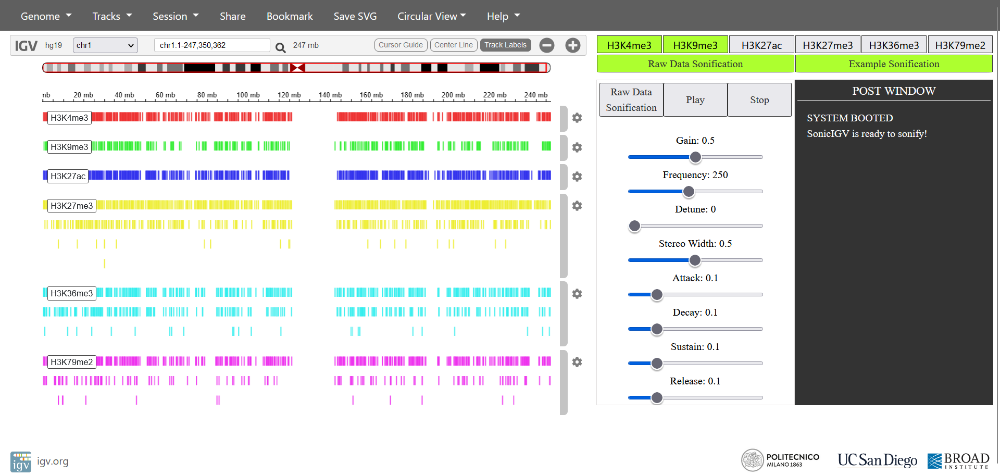

# SonicIGV - An IGV based Sonification Platform

### Author
Claudio Rapisarda, M. Sci. Music and Acoustic Engineering, Politecnico di Milano.

### Aknowledgement
This work was supported by Professor Bernardini Alberto, Professor Professor Ceri Stefano, Postdoc Nanni Luca and Professor Sarti Augusto.

## Description
SonicIGV is a long-term, open-minded project with the aim to create a platform able to provide strong analysis and sonification tools of genomic data together with the visualization tools provided by the IGV platform, licensed by MIT.

If you wish to know more about IGV and the people behind it, please visit the official website at the link https://igv.org/.

## How to run
The application is available at the link https://claudio-r.github.io.

__Beware!__ To correctly open the Sonification Module, move to "chr1" using the dropdown menu "all", in the left corner of the navbar. It may happen that moving from one chromosome to the other your browser gets stack. This is a bug in interfacing with IGV and will be fixed. Also, you should not use the canvas selector which opens up in the main page.

If you wish to clone the repository, no build operation is required. 
It is sufficient to move to the project directory and run the following code:
> npm run install  
> npx http-server -a localhost .

An online server will be created at localhost:8000 to use the application. Since the whole sonification system is implemented using the __WebAudio API__, I suggest using __Chrome__ to get the best results from your sonification.

## Contribution
SonicIGV has been built to be easily expandable and scalable. Contribution are really welcome!

The entry point is the __index.html__ file in the first level of folder. It includes as a script the __app.js__ file in _js/igv_source_ folder, which in turns calls the __SonicIGV.js__ script. 

The main code is contained in the _js_ folder. It contains the IGV source code, and the code related to SonicIGV, as well as the resources it uses.

In the _python_ folder there are some python scripts used for parsing the data.

Note that the data which do not relate to the first chromosome are not provided. Please contact me or Luca Nanni if you need them.
Also, the project folders contains a lot of files needed by IGV and that should not be deleted or modified.

### Adding a module

To add a new sonification module, implement it as a new class with the following characteristics:

1. The constructor must takes two arguments, the first being the complete set of information relative to the __signals__ associated to the currently selected chromosome, and the second being a __configuration object__ containing the identificative name of the actual signals to sonify, the start and stop indexes to sonify, as visualized in the application, and the values of parameters as defined by the user through the GUI.
These arguments will be passed automatically from the main application to the sonification processor.
2. It must implement a public method _play()_ to start the playback of the sonification. It is called when the user hits the play button in the GUI. 
3. It must implement a public method _stop()_ to stop the playback of the sonification. It is called when the user hits the stop button in the GUI.
4. The sonification processor should be completely indipendent and possibly, defined entirely within a single file to move into the _audioProcessors_ folder.

Once the processor is completed, it has to be imported into the __SonicIGV.js__ file within the _js_ folder, and a new item has to be included in the __index.js__ file. You can use the python script __json_creator.py__ in the _python_ folder to easily update the file.

The item should at least contain a _type_ field, displayed in the GUI, and a _formatted_name_ field, used internally to assign IDs to DOM element and other stuff.
Also, in the _init_params_ field, it should contains all the information relative to the slider control to visualize in the GUI. By now, the sonification platform automatically generates sliders only. If other type of input controllers are to be added, the structure of _init_params_ should be modified to properly inform the application, which should be modified as well to create the correct DOM elements.

Besides, the __json_creator.py__ file updates the epigenomic data contained in the __epigenomes.js__ file. This file contains for each chromosome and each histone the path to the _.narrowPeak_ and _.broadPeak_, automatically loaded into the application in purpose of visualization, and a field containing the actual data to process. By now only binary data relative to the first chromosome are available, but this is the file to modify in case other data are available.

Finally, if for any reason you need to interface with the IGV browser, you can use the Browser API available at the link https://github.com/igvteam/igv.js/wiki.